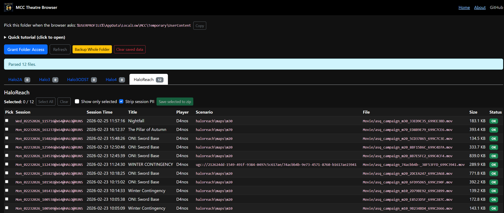

This app helps browse MCC theater files, preview metadata, and package selected files into a zip.

It works by requesting read access to your MCC Saved Films directory and saving the access permissions in IndexedDB, so that each time you visit, you shouldn't need to re-find your folder.

It then does a light parse of the metadata of your film files and displays them in a table where you can select the ones you want and save them to a ZIP file.

